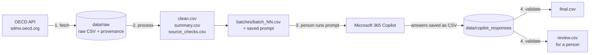

# oecd-data-pipeline

A small, auditable pipeline that pulls headline indicators from the
[OECD Data Explorer](https://data-explorer.oecd.org/) API, cleans them with
Python, has **Microsoft 365 Copilot** write a plain-English note for each
country, and then **checks every note with Python before accepting it**.

It shows one pattern: use code for the parts that can be written as rules,
use an AI assistant only where reading and wording are needed, and never
let the AI output through unchecked.

> Independent project. Not affiliated with or endorsed by the OECD.

## How it works



| Stage | Done by | What happens |
|---|---|---|
| 1. Fetch | Python | Downloads each indicator as SDMX-CSV. Keeps the response unchanged with its URL, timestamp and SHA-256 hash, so every figure can be traced to its download. Retries politely on rate limits. |
| 2. Process | Python | Rule-based cleaning: numeric values, expected countries only, periods that match the frequency, one series per country and period. Every problem is written to `source_checks.csv` rather than fixed silently. Then computes the latest value, change from the previous period and change from a year earlier. |
| 3. Interpret | Copilot | A person attaches one batch file and runs the saved prompt in `prompts/copilot_prompt.md`. Copilot fills two columns: `direction` (up / down / flat) and a one-sentence `note`. It never calculates anything; all figures are already in the row. |
| 4. Validate | Python | Matches answers back by `row_id` and checks: every row returned once, no unknown rows, `direction` agrees with the figures, the note is at most 30 words, and **the note contains no number that is not in that row**. Passing rows go to `final.csv`; the rest go to `review.csv` with reasons. |

The reasoning behind these choices is in [docs/decisions.md](docs/decisions.md).

There are no API costs: Python never calls an AI model, and the Copilot step
runs inside an existing Copilot licence.

## Quick start (Windows, VS Code)

```powershell
git clone https://github.com/flam7791/oecd-data-pipeline.git
cd oecd-data-pipeline
python -m venv .venv
.venv\Scripts\activate
pip install -e ".[dev]"

python -m oecd_pipeline run        # fetch + process
```

On macOS or Linux, activate with `source .venv/bin/activate`.

Then, for each file in `data/out/batches/`:

1. Open Microsoft 365 Copilot Chat and attach `batch_01.csv`.
2. Paste the prompt from `prompts/copilot_prompt.md` (also copied next to the batches).
3. Save Copilot's CSV answer as `data/copilot_responses/batch_01.csv`.

Finally:

```powershell
python -m oecd_pipeline validate
```

Read `data/out/validation_report.md`. The command exits with code 2 if any
row needs review.

### Trying it without Copilot

`python -m oecd_pipeline standin` fills the batches with template answers
(written to `data/standin_responses/`, never mixed with real Copilot
answers), so you can run the whole flow end to end:

```powershell
python -m oecd_pipeline standin
python -m oecd_pipeline validate --responses data/standin_responses
```

## Configuration

Everything is in [`config/indicators.toml`](config/indicators.toml):
countries, start period, batch size and the indicators. The defaults are:

| id | Data Explorer dataflow | Frequency |
|---|---|---|
| `unemployment_rate` | `OECD.SDD.TPS,DSD_LFS@DF_IALFS_UNE_M,1.0` | Monthly |
| `cpi_inflation` | `OECD.SDD.TPS,DSD_PRICES@DF_PRICES_ALL,1.0` | Monthly |
| `gdp_growth` | `OECD.SDD.NAD,DSD_NAMAIN1@DF_QNA_EXPENDITURE_GROWTH_OECD,1.1` | Quarterly |

To add an indicator, open the table in Data Explorer, choose **Developer
API**, copy the data query, and split it into `dataflow` and `key` as
explained at the top of the config file. Put `{countries}` where the country
list goes.

If you change an indicator's `flat_threshold`, update the matching rule in
the prompt too; the validator always uses the value from the config.

## Outputs (`data/out/`)

| File | Contents |
|---|---|
| `clean.csv` | Tidy table: one row per indicator, country and period, with source URL and download time |
| `source_checks.csv` | Every cleaning rule that fired, with counts |
| `summary.csv` | Latest figures, changes and rule-based flags (`large_move`, `lagging`, `no_previous`, `no_year_ago`) |
| `batches/` | Files to give to Copilot, plus the prompt |
| `final.csv` | Summary rows with accepted `direction` and `note` |
| `review.csv` | Rows that failed a check, with the reasons |
| `validation_report.md` | Short report of the validation run |

Downloaded data and outputs are kept out of git (see `.gitignore`).

## Tests

```powershell
pytest
```

The tests run offline against **synthetic** downloads in `tests/fixtures/`
(generated by `make_fixtures.py`; the numbers are invented, not OECD
statistics). They cover the fetch retry logic, every cleaning rule, the
summary figures, each validation check, and a full end-to-end run including
Copilot dropping a row and inventing a figure.

## Limits of this MVP

- **The live API calls were not run in the build environment.** The dataflow
  IDs and keys come from Data Explorer and DBnomics listings checked on
  2 October 2026. If a fetch returns no rows or an error, check the key
  against Data Explorer's Developer API panel.
- The OECD API is rate-limited. The pipeline pauses between calls and keeps
  each download, so `process` can be re-run without fetching again.
- The Copilot step is manual by design: it suits tens to low hundreds of
  rows. For larger volumes or scheduled runs, the same batches and
  validator work with a model called through an API.
- Reference-area names cover OECD members and a few aggregates; other codes
  are shown as codes.

## Data source and terms

Data: OECD Data Explorer, <https://data-explorer.oecd.org/>, via the API at
`sdmx.oecd.org`. The OECD made its data freely accessible in July 2024; check the
[OECD Terms & Conditions](https://www.oecd.org/en/about/terms-conditions.html)
for the current licence and attribution wording before publishing outputs.

## Licence

Code: MIT, see [LICENSE](LICENSE).
